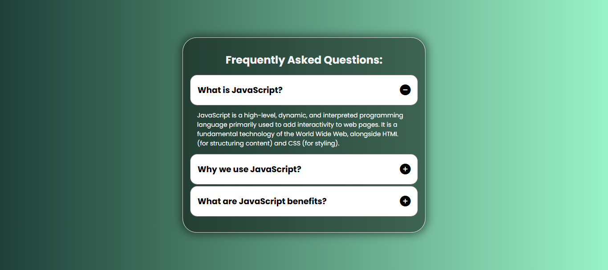

  # 🎯 Accordion FAQ Section | HTML, CSS & JavaScript

  An elegant, responsive **Accordion FAQ Section** built using **HTML**, **CSS**, and **Vanilla JavaScript**.  
  This project features a clean UI, smooth animations, and toggling icons for better user interaction.  
  Perfect for **web developers** looking to enhance their portfolio with interactive UI components.

  ---

  ## 📸 Demo Preview
  

  ---

  ## 🚀 Features
  - ✅ **Responsive Design** – Works on desktops, tablets, and mobiles  
  - ✅ **Smooth Animations** – Expand and collapse with fade effect  
  - ✅ **Font Awesome Icons** – Plus/Minus icons for better UX  
  - ✅ **Single Open Question** – Automatically closes others when one is opened  
  - ✅ **SEO-Friendly Content Structure**

  ---

  ## 🛠️ Technologies Used
  - **HTML5** – Markup structure  
  - **CSS3** – Styling and responsive layout  
  - **JavaScript (Vanilla)** – Accordion toggle functionality  
  - **Font Awesome** – Icons for UI feedback  
  - **Google Fonts** – Poppins font for modern typography

  ---

  ## 📂 Project Structure
  Accordion-FAQ-Section/
│── index.html
│── style.css
│── script.js
│── screenshot.png
└── README.md


---

## 📖 How to Use
1. **Clone the repository**
   ```bash
   git clone https://github.com/yourusername/accordion-faq-section.git
   ```
2. **Open `index.html` in your browser**  
   No additional setup required — works offline.

---

## 📜 Code Explanation

### HTML
- Structured using `.container` for main layout.
- `.question-box` wraps each FAQ item.
- Font Awesome icons for **plus/minus**.

### CSS
- Gradient background for a modern look.
- Hover effects for interactive feel.
- Smooth height and opacity transitions for FAQ answers.

### JavaScript
- `toggleFaq()` function to handle accordion open/close.
- Closes other questions when a new one is opened.
- Scrolls to active question for better user experience.

---

## 📱 Responsive Design
- **Desktop:** 40% width container
- **Tablet & Mobile:** 90% width for readability
- Flexible font sizes and spacing for all devices

---

## 🌟 Use Cases
- FAQ sections on business websites
- Help centers and documentation pages
- Interactive learning projects for web development

---

## 🤝 Contributing
Contributions, issues, and feature requests are welcome!  
Feel free to fork the repo and submit a pull request.

---

## 📄 License
This project is licensed under the **MIT License** — you can freely use and modify it.

---

💙 *If you found this project helpful, give it a ⭐ on GitHub!*

